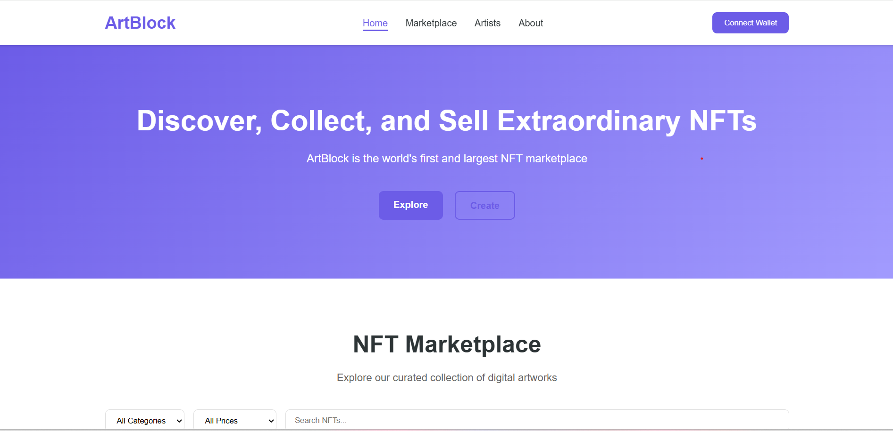
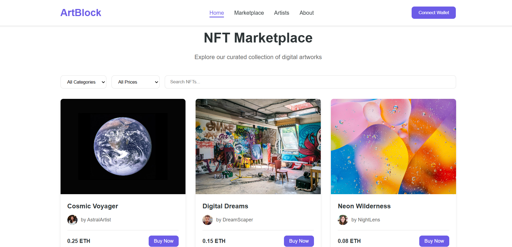
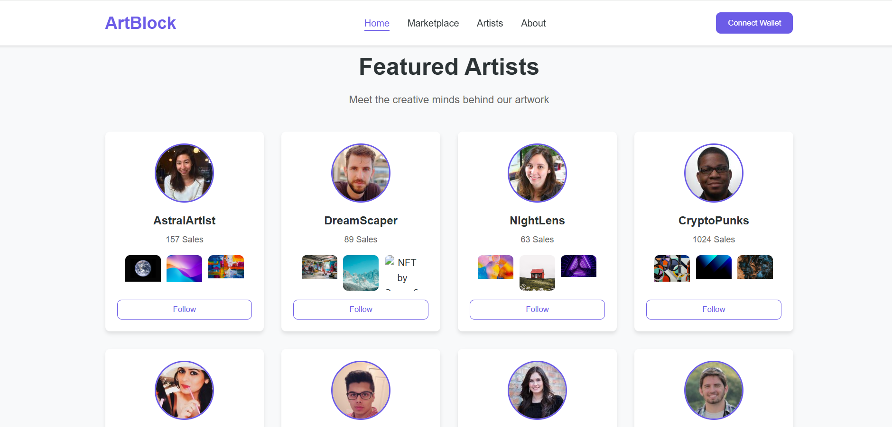
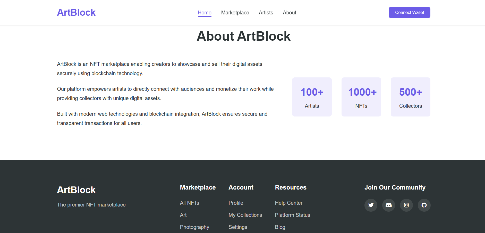

# ArtBlock - NFT Marketplace


<p align="center">
  
</p>

**ArtBlock** is a beginner-friendly NFT marketplace that allows artists to showcase and sell their digital creations securely using blockchain technology. This project simulates blockchain features with mock data and a future-ready MERN stack structure.


## 📸 Screenshots

### 🏠 Home Page
<p align="center">
  
</p>

### 🛒 Marketplace
<p align="center">
  
</p>

### 👩‍🎨 Artists
<p align="center">
  
</p>

### ℹ️ About
<p align="center">
  
</p>


### 🏠 Home Page
<p align="center">
  
</p>

### 🛒 Marketplace
<p align="center">
  
</p>

### 👩‍🎨 Artists
<p align="center">
  
</p>

### ℹ️ About
<p align="center">
  
</p>

## ✨ Features

- 🖼️ Frontend display of NFT listings with images and metadata
- 👩‍🎨 Artist profiles and collections
- 🔍 Filter NFTs by category, price, and search terms
- 👛 Mock wallet connection functionality
- 📝 Solidity smart contract for NFT transactions (simulation only)

## 🛠️ Technologies Used

- HTML, CSS & JavaScript
- Web3.js (mock integration)
- Solidity (smart contract sample)
- Designed for future integration with the **MERN Stack** (MongoDB, Express.js, React.js, Node.js)

## 📁 Project Structure

```
ArtBlock/
├── index.html            # Main HTML file
├── css/                  # CSS styles
├── js/                   # JavaScript files
│   ├── script.js         # Main JavaScript functionality
│   ├── nft-data.js       # Mock NFT data
│   ├── artist-data.js    # Mock artist data
│   └── web3-mock.js      # Mock Web3 integration
├── contracts/            # Solidity smart contracts
│   └── NFTMarketplace.sol # Main marketplace contract
├── assets/               # Images and other static assets
├── .github/              # GitHub templates and workflows
└── docs/                 # Documentation
```

## 🏗️ MERN Stack Roadmap

This project is structured to evolve into a full-fledged MERN stack application. See [MERN_IMPLEMENTATION.md](MERN_IMPLEMENTATION.md) for a detailed plan on backend development and React integration.

## 🚀 Getting Started

### Prerequisites

- Node.js (v14 or higher)
- npm or yarn

### Installation

1. Clone the repository
   ```bash
   git clone https://github.com/naman-bhayana/ArtBlock.git
   cd ArtBlock
   ```

2. Install dependencies
   ```bash
   npm install
   ```

3. Start the development server
   ```bash
   npm start
   ```

4. Open your browser and navigate to `http://localhost:8080`

## 🖥️ Frontend Highlights

- Responsive and accessible design
- Simple, clean user interface
- Category and price-based filters
- Search and artist profile views
- Animated UI interactions

## 📝 Smart Contract Overview

The Solidity contract demonstrates:

- NFT minting
- Listing NFTs for sale
- NFT purchases
- Marketplace fee logic
- Admin ownership and control

> ⚠️ *This smart contract is only for demonstration and has not been audited or deployed.*

## 🛣️ Roadmap

- [ ] Integrate with actual Ethereum or Polygon blockchain
- [ ] Implement NFT minting and upload via React
- [ ] Add user authentication and wallet connection
- [ ] Launch backend with Express.js and MongoDB
- [ ] Introduce bidding, auctions, and offer features
- [ ] Complete React.js migration for dynamic frontend

## 📄 License

This project is licensed under the MIT License - see the [LICENSE](LICENSE) file for details.

## 👥 Author

- **Naman Bhayana**  
  [GitHub](https://github.com/naman-bhayana) | [LinkedIn](https://www.linkedin.com/in/namanbhayana007)

## 🙏 Acknowledgements

- NFT images sourced from [Unsplash](https://unsplash.com)
- User avatars via [RandomUser.me](https://randomuser.me)
- Icons provided by [Font Awesome](https://fontawesome.com)
- Mock data and layout inspired by leading NFT platforms

